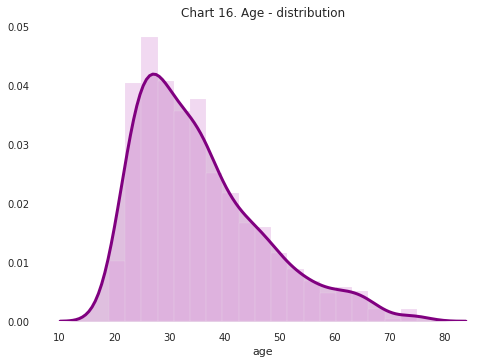
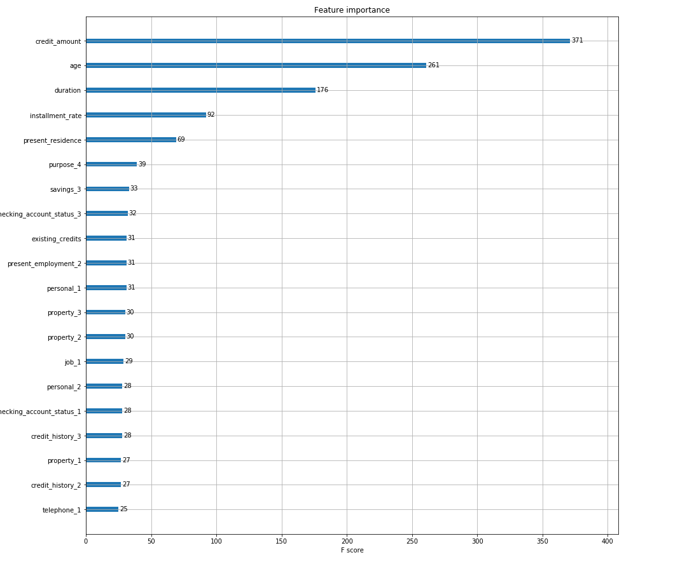
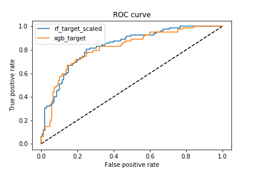

 

## **Etap I** Eksploracyjna analiza danych

```{r echo=FALSE,fig.align='center'}

 
``` 

## Co zostało zrobione? 

<ol>

<li>Zbadanie typów zmiennych i braków danych</li>
<li>Zbadanie balansu klas </li>
<li>Zbadanie korelacji zmiennych numerycznych</li>
<li>Analiza rozkładów zmiennych numerycznych i kategorycznych
<li>Głębsza analiza zmiennych, które były ze sobą mocniej skorelowane:</li>
<ol>
<li>Duration – credit_amount_variables</li>
<li>Installment_rate – credit_amount_variables</li>
</ol>
<li>Jaka grupa wiekowa dominuje pośród kredytobiorców?</li>

</ol>

## Etap II Feature Engineering

```{r echo=FALSE,fig.align='center',out.width = "79%",out.height="80%"}

 
``` 


## Co zostało zrobione?
<ol>
<li>Sprawdzenie możliwych skalowań </li>
<li>Wybór najlepszych modeli do dalszego rozwoju:</li>
<ol>
<li>XGB</li>
<li>Random Forest</li>
</ol>
<li>Sprawdzenie wpływu kodowań na wynik wybrano:</li>
<ol>
<li>Target Encoding</li>
<li>One Hote Encoding</li>
</ol>
<li>Ocena wpływu poszczególnych zmiennych na wynik dla algorytmów XGB i Random Forest</li>
</ol>
## Etap III Strojenie i ewaluacja modeli

```{r echo=FALSE,fig.align='center',out.height="80%",out.width="80%"}

 
``` 

## Co zostało zrobione?
<ol>
<li>Wybranie 2 klasyfiaktorów do dalszej analizy – XGBoost oraz Random Forest</li>
<li>Stworzenie modeli (pipelinów) z klasyfikatorami, kodowaniem oraz skalowaniem</li>
<li>Znalezienie optymalnych parametrów przy użyciu kroswalidacji oraz funkcji RandomizedSearchCV</li>
<li>Sprawdzenie tak przygotowanych modeli na zbiorze testowym</li>
<li>Porównanie wyników modeli względem miary AUC </li>
<li>Wybranie 2 modeli, które spisały się najlepiej </li>
</ol>

## Ostateczne wyniki

```{r echo = FALSE}
models <- c("rf_ohe",	"rf_ohe_scaled",	"rf_target"	,"rf_target_scaled"	,"xgb_ohe", "xgb_ohe_scaled", "xgb_target", "xgb_target_scaled")
auc <- c(0.831119,0.834495,0.813879,0.830611,0.799361, 0.803354,0.806693, 0.802773)
auc_tuned <- c(0.831301, 0.828978,0.820630, 0.830430, 0.812427, 0.812427, 0.816057, 0.799724)
df <- cbind(models, auc, auc_tuned)
knitr::kable(df)
```
