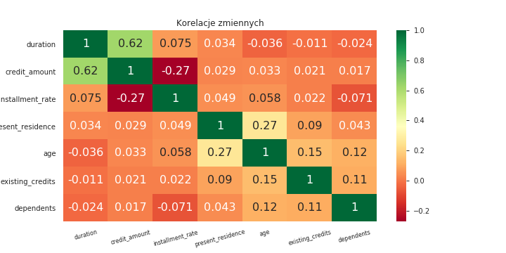
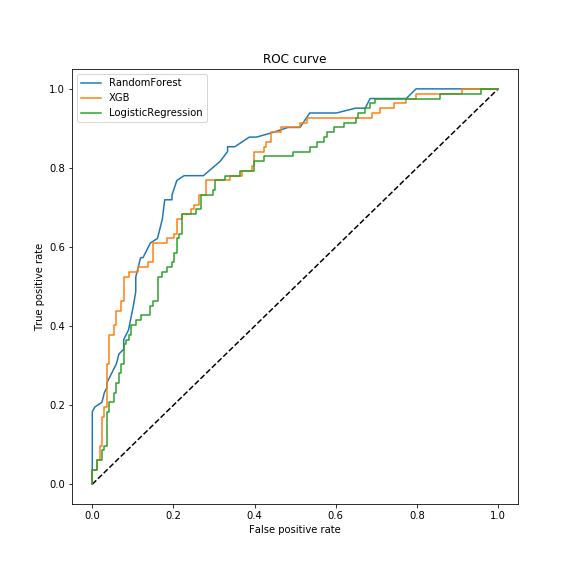
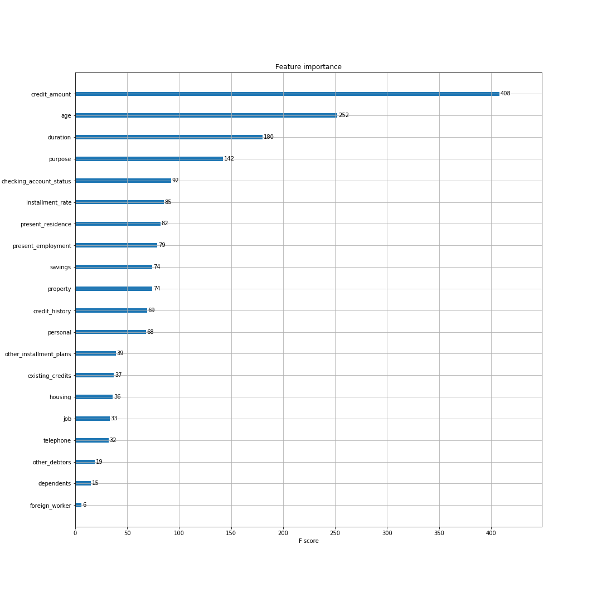
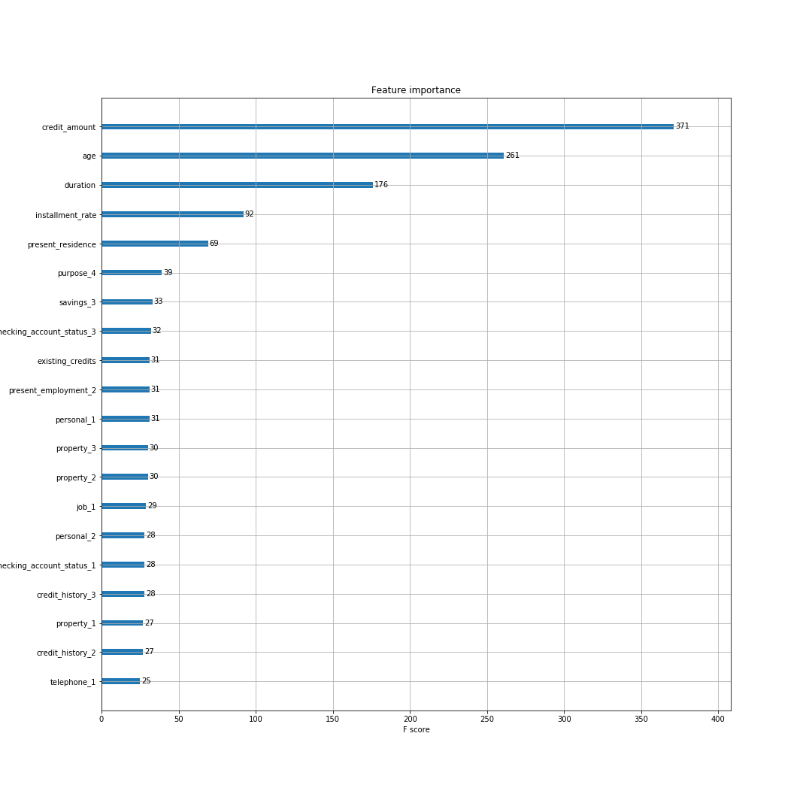
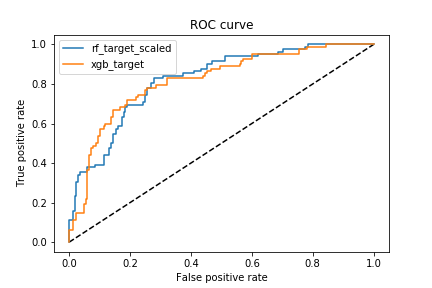

1. [Wstęp](#paragraph1)
2. [Esploracyjna analiza danych](#paragraph2)
3. [Inżynieria cech](#paragraph3)
      1. [Skalowanie zmiennych](#subparagraph1)
      1. [Kodowanie zmiennych](#subparagraph2)
      2. [Wstępne modelowanie](#subparagraph3)
      3. [Feature importance](#subparagraph4)
4. [Modelowanie i strojenie parametrów](#paragraph4)
    1. [Random Forest](#subparagraph41)
    2. [XGBoost](#subparagraph42)
    3. [Ewaluacja modeli](#subparagraph43)
5. [Podsumowanie](#paragraph5)

```{python setup, include = FALSE}
import pandas as pd 
import numpy as np
import category_encoders as ce
import xgboost as xgb
import sklearn
import seaborn as sns 
import matplotlib.pyplot as plt
import random
import warnings
from random import uniform
from sklearn import preprocessing 
from sklearn import metrics
from sklearn.model_selection import GridSearchCV, train_test_split
from sklearn.model_selection import cross_val_score
from sklearn.ensemble import RandomForestClassifier
from sklearn.ensemble import VotingClassifier
from sklearn.metrics import recall_score
from sklearn.metrics import precision_score
from sklearn.metrics import precision_recall_curve
from sklearn.metrics import plot_precision_recall_curve
from sklearn.pipeline import Pipeline
from sklearn.linear_model import LogisticRegression
from sklearn.preprocessing import MinMaxScaler
from sklearn.feature_selection import SelectKBest
from sklearn.feature_selection import f_classif
from sklearn.feature_selection import GenericUnivariateSelect
from sklearn.feature_selection import SelectFromModel
import warnings
warnings.filterwarnings('ignore')

np.random.seed(123) 

data = pd.read_csv("https://www.mldata.io/download-csv-weka/german_credit_data/")
num = data.select_dtypes(include=['float64', 'int']).drop('customer_type', axis = 1).columns
```
  
## 1. Wstęp <a name="paragraph1"></a>   
Wszelkie prace przeprowadzone na potrzeby projektu wykonane zostały na zbiorze German Credit Dataset. Jest to zbiór, zawierający niemieckie dane kredytowe prawdopodobnie sprzed 2002 roku. Występują w nim zarówno cechy numeryczne, jak i kategoryczne. Zmienną celu jest w nim binarna zmienna *customer_type*, określająca czy dany klient jest wiarygodny w kontekście przyznania kredytu, czy też nie.   
Istotnymi informacjami z punktu widzenia późniejszego doboru metod przetwarzania zbioru jest fakt niezbalansowania klas zmiennej odpowiedzi    
```{python, echo = FALSE}
data.customer_type.replace([1,2], [1,0], inplace=True)
data.customer_type.value_counts()
```
oraz fakt, że wszystkie zmienne kategoryczne są konsekwentnie zakodowane zgodnie z określoną konwencją.  
```{python, echo = FALSE}
cat = data.select_dtypes(include=['object']).columns.tolist()
data[cat].head()
```   
<br/><br/>  

W toku wstępnie przeprowadzonej analizy eksploracyjnej okazało się również, że w rozważanym zbiorze danych nie występują braki danych ani obserwacje, które mogłyby wydawać się niewiarygone, w związku z czym uznaliśmy, że nie wymaga on czyszczenia. 
```{python, echo = FALSE}
data.info()
```

<br/><br/>

## 2. Esploracyjna analiza danych <a name="paragraph2"></a>  
W toku przeprowadzonej analizy eksploracyjnej okazało się, że dane zgromadzone w zbiorze są w ogólności słabo skorelowane, a jedyną zmienną objaśniającą wchodzącą w jakiekolwiek *interakcje* z pozostałymi jest wysokość kredytu, o który ubiega się dany klient. 

```{R, fig.align = 'center', echo = FALSE, out.width = '700px'}

```    
<br/><br/>
Z tego powodu dalsza część tego rozdziału zorientowana jest przede wszystkim na wieloaspektową analizę cechy *credit_amount*.   
Rozważania na temat pozostałych, zostały przeprowadzone i przedstawione na etapie pierwszego kamienia milowego, jednak nie zostały ujęte w raporcie, gdyż nie prowadziły do wniosków istotnych z punktu widzenia kolejnych etapów prac.


```{python, fig.align = 'center', echo = FALSE}
sns.set_color_codes()
fig, ax = plt.subplots(figsize=(6, 4))

amount_dens = sns.distplot(data.credit_amount, hist = True, kde = True,
                 kde_kws = {'shade': True, 'linewidth': 3, 'color': 'darkred'}, color='red')
ax.set_title('Zmienna tożsama z wysokością kredytu')
```  
Wykres wskazuje rozkład jednomodalny. Biorąc pod uwagę kształt histogramu, możemy stwierdzić, że jest on zbliżony do wykładniczego.

Wyraźnie przesunięta krzywa gęstości w lewo sugeruje dodatnią wartość asymetrii. Dodatnia wartość tego współczynnika wskazuje na prawostronną asymetrię, co oznacza, że średnia arytmetyczna cechy jest większa niż mediana i że większość populacji jest sklasyfikowana powyżej średniego poziomu badanej cechy.  

```{python, echo=FALSE, include = FALSE, echo = FALSE}
fig, ax = plt.subplots(figsize = (6, 3))
ax.set_title('Zmienna tożsama z wysokością kredytu')
ax.boxplot(data.credit_amount, vert=False)
```
```{python, fig.align = 'center', echo = FALSE}
plt.show()
```     

Zmienną *credit_amount* charakteryzuje fakt występowania stosunkowo dużej ilości obserwacji, które mogą być uznane za odstające. Biorąc jednak pod uwagę charakter analizowanych danych, żadna z nich nie wzbudziła naszych wątpliwości w kontekście braku wiarygodności. Mając jednak świadomość tego problemu podczas dalszej eksploracji należało ograniczyć zakres dostępnych metod i charakterystyk do tych, które uznawane są za niewrażliwe na wartości odstające.

Najsilniejsza ze stwierdzonych korelacji dotyczy pary zmiennych *credit_amount* i *duration*. Zanim przeprowadziliśmy rozważania na temat ich dokładnych zależności postanowiliśmy za pomocą analogicznych geometrii jak dla wysokości kredytu, zbadać drugą ze składowych stwierdzonej korelacji.  

W tym przypadku okazało się, że rozkład zmiennej tożsamej z deklarowanym czasem spłaty kredytu jest wielomodalny i trudny do oszacowania nawet po logarytmizacji, ponadto występuje znaczny rozrzut danych przy umiarkowanym rozstępie międzykwartylowym oraz niewielkiej ilości obserwacji odstających. 


```{python, fig.align = 'center', echo = FALSE}
sns.lmplot(x="credit_amount", y="duration", col="customer_type", hue="customer_type", data=data, col_wrap=2, height=3.5).fig.suptitle('Wykres 4. ')
```    
Okazuje się, że część ludności o najniższych kwotach pożyczek ma najkrótszy okres spłaty. Przeciwny wniosek nie zachodzi. Zdarza się bowiem, że podmioty o relatywnie wysokich kwotach pożyczek mają krótki okres spłaty i odwrotnie.
Nie mniej jednak, w ogólności im wyższa kwota kredytu, tym dłuższy okres spłaty, przy czym współczynnik proporcjonalności jest większy w grupie klientów uznanych za wiarygodnych.     


Drugi co do wartości bezwzględnej współczynnik korelacji, dotyczy pary zmiennych: *credit_amount*, *installment_rate*.   
W odróżnieniu od powyższego, w tym przypadku stwierdzona korelacja jest ujemna. Cecha *installment_rate* jest tożsama z wysokością raty spłaty, wyrażoną jako odsetek dochodu kredytobiorcy. 
```{python, fig.align = 'center', echo = FALSE}
ax = sns.pairplot(data.iloc[:, [4, 7]], size = 3, hue = 'installment_rate', aspect=2, palette=('cubehelix'), 
                  markers='o')
ax.fig.suptitle('Zależność pomiędzy wysokościami kredytu i rat', y = 1)
plt.tight_layout()
plt.legend(loc='upper center', bbox_to_anchor=(1.10, 1.0), ncol=1) 
```  
Powyższa wizualizacja wskazuje, że dłużnicy zaciągający najniższe kredyty, przeznaczają największy procent dochodu na ich spłatę (4%). Nie wiadomo jednak, czy wynika to faktu relatywnie niewielkiej wysokości pożyczki czy niskich zarobków. W ogólności zauważalna jest tendencja spadku wysokości raty wraz ze wzrostem kwoty kredytu, nie mniej jednak dla rat wynoszących odpowiednio 1, 2 i 3 procent deklarowanych dochodów rozkłady wysokości kredytów są zbliżone.     

Podczas analizy, okazało się również, że wśród kredytobiorców dominują osoby w wieku 20-40 lat i to właśnie dla tej grupy wiekowej, wysokości zaciąganych pożyczek są najsilniej zróżnicowane.  
```{python, fig.align = 'center', echo = FALSE}
g = sns.jointplot(x=data["age"], y=data["credit_amount"], kind='hex', color = 'darkblue', height = 4.5)
g.fig.suptitle('Zależność wysokości kredytu od zmiennej wieku')
```
W toku prowadzonej eksploracji okazało się, że poza zmiennymi ciągłymi, istotny wpływ na wysokość kredytu mają niektóre zmienne kategoryczne. Najciekawsze wnioski, w kontekście przeprowadzonej później inżynierii cech,  otrzymano dla zmiennych tożsamych z rodzajem oraz celem kredytu.    
Rozważmy kolejno wyżej wymienione zmienne.  
```{python, fig.align = 'center', echo = FALSE} 
fig, ax = plt.subplots(figsize=(8, 4))
sns.violinplot(data.other_debtors, data.credit_amount).set_title('Zależność pomiędzy wysokością i rodzajem kredytu')
```    

Istnieje silna zależność pomiędzy zmiennymi. Okazuje się, że pożyczki zaciągane przez współkredytobiorców są średnio najniższe, natomiast wśród kredytów pożwiadczonych nie występują żadne opiewające na kwotę wyższą niż 10 000.    

W przypadku deklarowanego celu, na który klient ma przeznaczyć środki kredytowe, sytuacja jest o tyle nietypowa w porównaniu z poprzednimi, że pomimo silnego wpływu tej zmiennej, jest ona trudna do wykorzystania w kontekście predykcji.   
Określanie wiarygodności klienta, na podstawie tego na co zaciąga dany kredyt, może z łatwością zostać poddane w wątpliwość.    


```{python, fig.align = 'center', echo = FALSE}
fig, ax = plt.subplots(figsize=(8, 4))
sns.violinplot(data.purpose, data.credit_amount).set_title('Zależność pomiędzy wysokością i celem kredytu')
```

## 3.Inżynieria cech <a name="paragraph3"></a>

```{python, include = FALSE, fig.align = 'center', echo = FALSE}
cols = cat
#Data split 
X_train, X_test, Y_train, Y_test = train_test_split(data.drop('customer_type', axis=1), data['customer_type'])
# Scaling 
```  

##3.1. Skalowanie <a name="subparagraph1"></a>
```{python, include = FALSE, fig.align = 'center'}
cols = cat
#Data split 
X_train, X_test, Y_train, Y_test = train_test_split(data.drop('customer_type', axis=1), data['customer_type'])
# Scaling 
```
Dane przeskalowaliśmy używając funkcij StandardScaler z pakietu sklern która przekształca zmienną $X$ w następujący sposób:\
$z=\frac{(x-u)}{s}$\
gdzie  
$u$ - średnia artmetyczna obserwacij X\
$s$ - odchylenie standardowe\
Inaczej mówiąc funkcja dokonuje standaryzacij zmiennych numerycznych.


##3.2. Kodowanie zmiennych <a name="subparagraph2"></a>
Zdecywowaliśmy się użyć dwóch rodzajów kodowania: TargetEncoding, który korzysta ze zmiennej celu i jest dość zawansowaną metodą kodowania, nie zwiększającą rodzaju danych, oraz prostszy One Hot Encoding, tworzący nową kolumnę dla każdej kategorii. Ponieważ w przypadku rozważanego zbioru liczba powstałych kolumn nie jest zbyt duża, może być skutecznie zastosowany.
<br/><br/>
**Dane po TargetEncoding'u**:
```{python, echo = FALSE}
ce.TargetEncoder(data,cols=cols).fit_transform(X_train,Y_train).head().iloc[:,1:10]
```
<br/><br/>
**Dane po One Hot Encoding'u**:  
```{python, echo = FALSE}
ce.OneHotEncoder(data,cols=cols).fit_transform(X_train, Y_train).head().iloc[:,1:10]
```

##3.3. Wstępne modelowanie <a name="subparagraph3"></a>
W celu przeprowadzenia pierwszych testów zdecydowaliśmy się wstępnie wytrenować 3 różne klasyfikatory:\
 - Regresję Logistyczną\
 - Random Forest\
 - XGB\

Modele nie przeszły optymalizacji parametrów - tym zajęliśmy się w dalszej części. Dane używane w tych testach nie zostały poddane skalowaniu.\ Wyniki prezentują się następująco:  

```{R, fig.align = 'center', echo = FALSE, out.width = '500px'}


```

Jak widać algorytm regresij logistycznej okazał się gorszy od pozostałych, dlatego też nie został uwzględniony w kolejnych etapach prac.   

**Wyniki AUC**:

```{python, fig.align = 'center', echo = FALSE}
pd.DataFrame({"Model" : ["RandomForest", "XGB", "LogisticRegression"],
             "AUC": [0.83, 0.81, 0.77]})
```

##3.4. Feature importance <a name="subparagraph4"></a>
W tej części sprawdziliśmy, czy uwzględnienie w modelowaniu wszystkich dostepnych kolumn daje optymalne wyniki, czy może lepsze okaże się zastosowanie tylko wybranych. Ponownie będziemy korzystać z Target oraz One-Hot encoding używając algorytmów RandomForest oraz XGB.  

<br/><br/>
**XGB**:    

<div align = 'center'>**Target Encoding**</div>
```{R fig.align = 'center', echo = FALSE, out.width = '900px'}

```  
<div align = 'center'>**One Hot Encoding**</div>  


```{R, fig.align = 'center', echo = FALSE, out.width = '900px'}

```


Pomimo zupełnie różnych kodowań najważnejsze 3 zmienne pozostają te same. Warto też zauważyć, że większą wagę algorytm nadaje zmiennym numerycznym, takim jak credit_ammount.\
<br/><br/>
**RandomForest**:


```{python, fig.align = 'center', include = FALSE, echo = FALSE}

# Target encoding 


rf_test = RandomForestClassifier()
rf_test.fit(ce.TargetEncoder().fit_transform(X_train,Y_train),Y_train)
importances = rf_test.feature_importances_
std = np.std([tree.feature_importances_ for tree in rf_test.estimators_],
             axis=0)
indices = np.argsort(importances)[::-1]     
rf_test = RandomForestClassifier()
rf_test.fit(ce.OneHotEncoder().fit_transform(X_train),Y_train)
importances1 = rf_test.feature_importances_
std1 = np.std([tree.feature_importances_ for tree in rf_test.estimators_],
             axis=0)
indices1 = np.argsort(importances1)[::-1]                         
indices = np.argsort(importances)[::-1]
```  

```{python, echo = FALSE, fig.align = 'center', include = FALSE}
indices = np.argsort(importances)[::-1]
fig, (ax1, ax2) = plt.subplots(2, 1,figsize=(8, 8))


ax1.bar(ce.OneHotEncoder().fit_transform(X_train).columns[:10], importances1[indices1][:10],
       color="r", yerr=std1[indices1][:10], align="center",)
ax1.set_xticklabels(ce.OneHotEncoder().fit_transform(X_train).columns[:10] ,rotation=45,size=8)
ax2.bar(X_train.columns[:10], importances[indices][:10],
       color="r", yerr=std[indices][:10], align="center",)
ax2.set_xticklabels(X_train.columns[:10],rotation=45,size=8)
fig.tight_layout(pad=0.3)
```     

<div align = 'center'>**One Hot Encoder**</div>
```{python, echo = FALSE, fig.align = 'center'}
ax2.set_title('Target Encoder', size = 8)

ax1.set_title('OneHot Encoding', size = 8)
```    


Zmiana algorytmu doprowadziła do znacznych zmian w wadze zmiennych.\ Tym razem zmienne kategoryczne zyskały przewagę nad numerycznymi.\


```{python, echo = FALSE}
from boruta import BorutaPy
from sklearn.model_selection import cross_val_score


def test(X_train,X_test,model,scaled_Y_train):

    
    

    feat_selector = BorutaPy(model, n_estimators='auto',random_state=1)
    feat_selector.fit(X_train.values,scaled_Y_train)


    # feature ranking
    a=feat_selector.support_
    ranking=feat_selector.ranking_
    print(ranking)

    def checking(X_train,X_test,a,ranking,model):
        for i in range(1,max(ranking)+1):
    
            data_test = ranking<=i
            
            cv_score=cross_val_score(model,X_train.iloc[:,data_test],scaled_Y_train,cv=5,n_jobs=-1)
            print(f"Treschold: {i}   CV_score_mean:  {round(np.mean(cv_score),3)} Cv_score_std {round(np.std(cv_score),3)}")

    # checking for all posible treschold 

    checking(X_train,X_test,a,ranking,model)
    return ranking
    
```  
<br/><br/>
**Wybór najlepszych zmiennych przy użyciu algorytmu Boruta oraz kroswalidacji.**  

Test zostanie ponownie przeprowadzony dla 4 przypadków, skupiając się w większym stopniu na poprawie dawanej przez usuwanie kolumn, niż na tym, które kolumny zostały usunięte.\  
<br/><br/>  

**XGB & Target Encoding**:

```{python, echo = FALSE}  
te = ce.TargetEncoder()
oh = ce.OneHotEncoder()


test(te.fit_transform(X_train, Y_train),te.transform(X_test),xgb.XGBClassifier(),Y_train)
```  
W tym wypadku okazuje się, że prawie każde zwiększenie liczby zmiennych poprawia wyniki, tym samym optymalnym rozwiązaniem jest uwzględnienie wszystkich dostępnych.  

<br/><br/>  

**XGB & One Hot Encoding** : 
```{python, echo = FALSE}  
te = ce.TargetEncoder()
oh = ce.OneHotEncoder()


test(oh.fit_transform(X_train),oh.transform(X_test),xgb.XGBClassifier(),Y_train)
```  
Tutaj najlepszy wynik uzyskujemy przy użyciu treschold = 7, który odpowiada 8 zmiennym. Warto też zauważyć, że w tym przypadku nawet mała ilość zmiennych pozwala na uzyskanie dobrego wyniku.  To oznacza, że po encodingu niektóre utworzone kolumny są mocno skolerowane ze zmienną celu. 
<br/><br/>
**RandomForest & Target Encoding**:
```{python, echo = FALSE}  
te = ce.TargetEncoder()
oh = ce.OneHotEncoder()


test(te.fit_transform(X_train, Y_train),te.transform(X_test),RandomForestClassifier(),Y_train)
```  
W powyższym przypadku, wynik konsekwentnie poprawia się wraz ze zwiększaniem liczby zmiennych. Nie mniej jednak, w niektórych przypadkach rezultat jest delikatnie lepszy niż dla uwzględnienia wszystkich zmiennych. Przy czym, różnice są minimalne.
<br/><br/>
**RandomForest & One Hot Encoding**:
```{python, echo = FALSE}  
te = ce.TargetEncoder()
oh = ce.OneHotEncoder()


test(oh.fit_transform(X_train),oh.transform(X_test),RandomForestClassifier(),Y_train)
```  

Inaczej niż dla XGB, dopiero większa ilość zmiennych daje zadowalający wynik oraz podobnie jak dla Target Encodingu widać poprawę przy zwiększaniu ich ilości.  Rezultat prawie najlepszy uzyskujemy po uwzględnieniu wszystkich dostępnych kolumn.  

W przypadku Random Forest, do uzyskania dobrej jakości wyników, wymagana jest większa liczba zmiennych niż dla XGB.  
Ponadto, dla tego właśnie algorytmu, wynik, pomijając małe odstępstwa, konsekwentnie się poprawia wraz ze wzrostem liczby używanych zmiennych. Wyniki w XGB są analogiczne tylko dla Target Encodingu. W przypadku kodowania One-Hot najlepszy rezultat uzyskujemy przy około połowie zmiennych.   
Ogólnym faktem jest natomiast wynik zbliżony do najlepszego przy uzyciu wszyskich kolumn dla 4 sprawdzanych przypadków.


## 4. Modelowanie i strojenie parametrów <a name="paragraph4"></a> 

Zdecydowaliśmy zająć się dwoma modelami opartymi na 2 klasyfikatorach - Random Forest oraz XGBoost, ponieważ to ich wyniki były najbardziej zadowalajace.

### 4.1 Random Forest <a name="subparagraph41"></a> 
Pierwszym klasfikatorem jaki wzięliśmy na warsztat był Random Forest. Stworzyliśmy pipeliny, gdzie oprócz klasyfikatora mieliśmy encoding zmiennych kategorycznych oraz skalowanie danych numerycznych. W ten sposób otrzymaliśmy 4 modele:

- Random Forest + OneHotEncoder
- Random Forest + OneHotEncoder + StandardScaler
- Random Forest + TargetEncoder
- Random Forest + TargetEncoder + StandardScaler

Stworzyliśmy bazowy klasyfikator z domyślnymi wartościami parametrów, a następnie dla każdego z modeli ustaliliśmy siatkę atrybutów, które stroiliśmy.

```{python, results = "hide", , echo = FALSE}
# Model
rf_classifier = RandomForestClassifier()

# Hiperparametry
rf_param_grid = {
    'classifier__n_estimators' : [50, 100, 200],
    'classifier__max_depth' : [None, 4, 8],
    'classifier__min_samples_split' : [1.0, 2, 4],
    'classifier__min_samples_leaf' : [1, 2, 3],
    'classifier__min_weight_fraction_leaf' : [0, 0.2, 0.5],
    'classifier__max_features' : ['sqrt', 'log2', 'auto'],
    'classifier__max_leaf_nodes' : [None, 4, 10],
    'classifier__min_impurity_decrease' : [1e-7, 1e-5, 1e-3],
    'classifier__oob_score' : [True, False],
    'classifier__random_state' : [None, 42],
    'classifier__ccp_alpha' : [0.0, 0.1, 0.2],
    'classifier__max_samples' : [None, 0.1, 0.5, 0.9]    
}
```

Opis uwzględnionych parametrów:

- **n_estimators** - ilość drzew składowych (int, domyślnie 100)
- **max_depth** - maksymalna głębokość drzewa (int, domyślnie None)
- **min_samples_split** - minimalna liczba obserwacji wymagana do podziału węzła wewnętrznego (int/float, domyślnie 2)
- **min_samples_leaf** - minimalna liczba obserwacji wymagana względem liścia (int, domyślnie 1)
- **min_weight_fraction_leaf** - minimalna frakcja wag wymagana względem liścia (domyślnie 0)
- **max_features** - ilość cech branych pod uwagę podczas poszukiwania najlepszego podziału (string). Jeśli “sqrt”, to max_features=sqrt(n_features), jeśli “log2”, to max_features=log2(n_features).
- **max_leaf_nodes** - maksymalna liczba liści (int, domyślnie None)
- **min_impurity_decrease** - węzeł zostanie podzielony, jeśli podział ten spowoduje zmniejszenie miary impurity większe lub równe tej wartości. (float, domyślnie 0)
- **oob_score** - gdy zestaw treningowy dla bieżącego drzewa jest rysowany przez próbkowanie z wymianą, około jedna trzecia przypadków jest pomijana. Te dane OOB są używane do uzyskania bezstronnego oszacowania błędu klasyfikacji (bool, domyślnie False)
oob_score - liczba powtórzeń instrukcji fit, predict, ect.
- **random_state** - kontroluje losowość procedury bootstrap
verbose - int, domyślnie 0 - im wyższa liczba tym więcej informacji uzyskami na temat procedur fit i predict
warm_start - Po ustawieniu wartości True ponownie użyje bieżącego rozwiązania, aby dopasować i dodać więcej estymatorów do zestawu, w przeciwnym razie po prostu zmieni cały nowy las. (bool, domyślnie False)
- **ccp_alpha** - dotyczy przycinania, zostanie wybrane poddrzewo o największym koszcie, który jest mniejszy niż ccp_alpha. Domyślnie 0.0, czyli przycinanie nie jest wykonywane.
- **max_samples** - dotyczy procedury bootstrap (domyślnie None)
<br/><br/>

Każdy z modeli został został przepuszczony przez funkcję RandomizedSearchCV, która w sposób losowy wybiera parametry, a następnie za pomocą kroswalidacji na zbiorze testowym bada ich efektywnosć względem miary AUC. Ilość iteracji została ustawiona na 1000, a każda iteracja podlegała 5-krotnej kroswalidacji Dla każdej iteracji była obliczana średnia z wyników AUC z wykonanych kroswalidacji, a następnie został wybrany zestaw parametrów, gdzie ta średnia była najwyższa. Najlepsze parametry dla poszczególnych modeli prezentują się następująco:
<br/><br/>

**Random Forest + OneHotEncoder**
```{python, echo = FALSE}
{'classifier__random_state': None, 'classifier__oob_score': True, 'classifier__n_estimators': 200, 'classifier__min_weight_fraction_leaf': 0, 'classifier__min_samples_split': 2, 'classifier__min_samples_leaf': 2, 'classifier__min_impurity_decrease': 1e-07, 'classifier__max_samples': 0.1, 'classifier__max_leaf_nodes': 10, 'classifier__max_features': 'log2', 'classifier__max_depth': None, 'classifier__ccp_alpha': 0.0}
```
Uśrednione AUC dla najlepszej iteracji: 0.771
<br/><br/>

**Random Forest + OneHotEncoder + StandardScaler**
```{python, echo = FALSE}
{'classifier__random_state': None, 'classifier__oob_score': True, 'classifier__n_estimators': 200, 'classifier__min_weight_fraction_leaf': 0, 'classifier__min_samples_split': 2, 'classifier__min_samples_leaf': 2, 'classifier__min_impurity_decrease': 1e-07, 'classifier__max_samples': 0.1, 'classifier__max_leaf_nodes': 10, 'classifier__max_features': 'log2', 'classifier__max_depth': None, 'classifier__ccp_alpha': 0.0}
```
Uśrednione AUC dla najlepszej iteracji: 0.771
<br/><br/>

**Random Forest + TargetEncoder**
```{python, echo = FALSE}
{'classifier__random_state': None, 'classifier__oob_score': True, 'classifier__n_estimators': 200, 'classifier__min_weight_fraction_leaf': 0, 'classifier__min_samples_split': 2, 'classifier__min_samples_leaf': 2, 'classifier__min_impurity_decrease': 1e-07, 'classifier__max_samples': 0.1, 'classifier__max_leaf_nodes': 10, 'classifier__max_features': 'log2', 'classifier__max_depth': None, 'classifier__ccp_alpha': 0.0}
```
Uśrednione AUC dla najlepszej iteracji: 0.770
<br/><br/>

**Random Forest + TargetEncoder + StandardScaler**
```{python, echo = FALSE}
{'classifier__random_state': None, 'classifier__oob_score': True, 'classifier__n_estimators': 200, 'classifier__min_weight_fraction_leaf': 0, 'classifier__min_samples_split': 2, 'classifier__min_samples_leaf': 2, 'classifier__min_impurity_decrease': 1e-07, 'classifier__max_samples': 0.1, 'classifier__max_leaf_nodes': 10, 'classifier__max_features': 'log2', 'classifier__max_depth': None, 'classifier__ccp_alpha': 0.0}
```
Uśrednione AUC dla najlepszej iteracji: 0.76
<br/><br/>


### 4.2 XGBoost <a name="subparagraph42"></a> 
Analogicznie postąpiliśmy w przypadku klasyfiaktora XGBoost, również stworzyliśmy 4 modele:

- XGBoost + OneHotEncoder
- XGBoost + OneHotEncoder + StandardScaler
- XGBoost + TargetEncoder
- XGBoost + TargetEncoder + StandardScaler

Tutaj siatka parametrów wygladała następująco:

```{python, echo = FALSE}
param_grid = {
    'classifier__max_depth': range (2, 10, 1),
    'classifier__min_child_weight': range(1,10,1),
    'classifier__gamma': [i/10.0 for i in range(0,50,5)],
    'classifier__subsample': [i/100.0 for i in range(50,100,5)],
    'classifier__colsample_bytree': [i/100.0 for i in range(50,100,5)],
    'classifier__learning_rate': [0.0001,0.01,0.1,0.2,0.3],
    'classifier__n_estimators': [50,100,150,300,500,600,700,800,1000]
    }
```

Opis uwzględnionych parametrów:

- **max_depth** - maksymalna głebokość drzewa, im większa wartość tym bardziej skompikowany model - może prowadzic do overfittingu (int, domyślnie 6)  
- **min_child_weight** - minimalna suma wag, wymagana w węźle potomnym
- **gamma** - minimalna "loss reduction" do przeprowadzenia dalszego podziału liścia (domyślnie 0)
- **subsample** - frakcja danych do próbkowania przed tworzeniem drzewa, tak aby uniknąć overfittingu (domyslnie 1)
- **colsample_bytree** -  frakcja kolumn wzięta do tworzenia każdego z drzew (domyślnie 1)
- **learning_rate** -im mniejsza wartość tym mniejsze kroki nauczania każdego z drzew (domyślnie 0.02)
- **n_estimators** - ilość drzew składowych (int, domyślnie 100)

Najlepsze parametry dla poszczególnych modeli prezentują się następująco:
<br/><br/>

**XGBoost + OneHotEncoder**
```{python, echo = FALSE}
{'classifier__subsample': 0.6, 'classifier__n_estimators': 700, 'classifier__min_child_weight': 3, 'classifier__max_depth': 2, 'classifier__learning_rate': 0.01, 'classifier__gamma': 1.0, 'classifier__colsample_bytree': 0.75}
```
Uśrednione AUC dla najlepszej iteracji: 0.774
<br/><br/>

**XGBoost + OneHotEncoder + StandardScaler**
```{python, echo = FALSE}
{'classifier__subsample': 0.6, 'classifier__n_estimators': 700, 'classifier__min_child_weight': 3, 'classifier__max_depth': 2, 'classifier__learning_rate': 0.01, 'classifier__gamma': 1.0, 'classifier__colsample_bytree': 0.75}
```
Uśrednione AUC dla najlepszej iteracji: 0.775
<br/><br/>

**XGBoost + TargetEncoder**
```{python, echo = FALSE}
{'classifier__subsample': 0.6, 'classifier__n_estimators': 50, 'classifier__min_child_weight': 3, 'classifier__max_depth': 4, 'classifier__learning_rate': 0.1, 'classifier__gamma': 4.5, 'classifier__colsample_bytree': 0.9}
```
Uśrednione AUC dla najlepszej iteracji: 0.781
<br/><br/>

**XGBoost + TargetEncoder + StandardScaler**
```{python, echo = FALSE}
{'classifier__subsample': 0.95, 'classifier__n_estimators': 600, 'classifier__min_child_weight': 4, 'classifier__max_depth': 2, 'classifier__learning_rate': 0.2, 'classifier__gamma': 2.0, 'classifier__colsample_bytree': 0.75}
```
Uśrednione AUC dla najlepszej iteracji: 0.771

### 4.3 Ewaluacja modeli <a name="subparagraph43"></a> 

Następnie tak wytrenowane modele przetestowaliśmy na zbiorze testowym. Wyniki prezentują się następująco:
```{r echo = FALSE}
model <- c("rf_ohe","rf_ohe_scaled","rf_target","rf_target_scaled",
        "xgb_ohe", "xgb_ohe_scaled", "xgb_target", "xgb_target_scaled")
auc_values <- c(0.819251,0.805096,0.815621,0.823969,0.812427,0.812427,0.816057,0.799724)
df <- cbind(model, auc_values)
knitr::kable(df)
```

Po wynikach na danych testowych możemy zaobserwować, że nie jest zasadą, że skalowanie danych poprawia rezultat każdego z modeli. Mimo to wyniki każdego z nich są co najmniej zadowalające - AUC powyżej 80%. 

Wybraliśmy 2 modele z najlepszymi wynikami - Random Forest + TargetEncoder + StandardScaler (rf_target_scaled) oraz XGBoost + TargetEncoding (xgb_target) i przyjrzeliśmy im się szczegółowiej. Bardziej szczegółowe wyniki zostały przedstawione poniżej.

```{python echo = FALSE}
from sklearn.ensemble import RandomForestClassifier
import xgboost as xgb
from sklearn.preprocessing import StandardScaler,FunctionTransformer
from sklearn import metrics
from sklearn.metrics import recall_score
from sklearn.metrics import accuracy_score
from sklearn.pipeline import Pipeline, FeatureUnion
from sklearn.metrics import precision_score

def makePipeline(cat_indices, num_indices, classificator, encoder, scaled = False):
    
    if scaled == True:
        pipeline = Pipeline(steps = [
        ('feature_processing', FeatureUnion(transformer_list = [
                ('categorical', FunctionTransformer(lambda data: data[cat_indices])),

                #numeric
                ('numeric', Pipeline(steps = [
                    ('select', FunctionTransformer(lambda data: data[num_indices])),
                    ('scale', StandardScaler())
                            ]))
            ])),
        ('encoder', encoder),
        ('classifier', classificator)
        ]
    )
    else:
        pipeline = Pipeline([
        ('encoder', encoder),
        ('classifier', classificator)
        ])
    return pipeline
    
# Kolumny z danymi numerycznymi
num = data.select_dtypes(include=['float64', 'int']).drop('customer_type', axis = 1).columns

# Kolumny z danymi kategorycznymi
cat = data.select_dtypes(include=['object']).columns.tolist()    


xgb_classifier = xgb.XGBClassifier(base_score=0.5, booster=None, colsample_bylevel=1,
               colsample_bynode=1, colsample_bytree=0.9, gamma=4.5, gpu_id=-1,
               importance_type='gain', interaction_constraints=None,
               learning_rate=0.1, max_delta_step=0, max_depth=4,
               min_child_weight=3, monotone_constraints=None,
               n_estimators=50, n_jobs=4, nthread=4, num_parallel_tree=1,
               objective='binary:logistic', random_state=0, reg_alpha=0,
               reg_lambda=1, scale_pos_weight=1, silent=True, subsample=0.6,
               tree_method=None, validate_parameters=False, verbosity=None)
               
rf_classifier = RandomForestClassifier(bootstrap=True, ccp_alpha=0.0, class_weight=None,
                        criterion='gini', max_depth=None, max_features='log2',
                        max_leaf_nodes=None, max_samples=0.9,
                        min_impurity_decrease=1e-05, min_impurity_split=None,
                        min_samples_leaf=3, min_samples_split=2,
                        min_weight_fraction_leaf=0, n_estimators=200,
                        n_jobs=None, oob_score=True, random_state=None,
                        verbose=0, warm_start=False)
                        
rf_target_scaled_pipeline = makePipeline(cat, num, rf_classifier, ce.TargetEncoder(), True)
xgb_target_pipeline = makePipeline(cat, num, xgb_classifier, ce.TargetEncoder(), False)

def evaluateModel(model, X_train, Y_train, X_test, Y_test):
    model.fit(X_train, Y_train)
    y_pred = model.predict(X_test)
    y_proba = model.predict_proba(X_test)[:, 1]
    y_true = Y_test
    print("Accuracy: " + str(accuracy_score(y_true, y_pred, normalize=True)))
    print("Precision: " + str(precision_score(y_true, y_pred, average='macro')))
    print("Recall: " + str(recall_score(y_true, y_pred)))
    #plt.figure()
    #plt.plot([0, 1], [0, 1], 'k--')
    #plt.plot(fpr, tpr)
    #plt.xlabel('False positive rate')
    #plt.ylabel('True positive rate')
    #plt.title('ROC curve')
```

```{python fig.align = 'center', fig.size = '60%', echo = FALSE}
evaluateModel(xgb_target_pipeline, X_train, Y_train, X_test, Y_test)
```

```{python fig.align = 'center', fig.size = '60%', echo = FALSE}
evaluateModel(rf_target_scaled_pipeline, X_train, Y_train, X_test, Y_test)
```

```{R, fig.align = 'center', echo = FALSE, out.width = '500px'}

```   

# 5. Podsumowanie  <a name="paragraph5"></a> 

Porównajmy wytrenowane przez nas modele z modelami opartymi na klasyfikatorach z domyślnymi parametrami, aby sprawdzić czy cała procedura spełniła swój cel.

```{r echo = FALSE}
models <- c('rf_ohe',	'rf_ohe_scaled',	'rf_target'	,'rf_target_scaled'	,'xgb_ohe','xgb_ohe_scaled','xgb_target','xgb_target_scaled'	)
auc_not_tuned <- c(0.831119,0.834495,0.813879,0.830611,0.799361, 0.803354,0.806693, 0.802773)
auc_tuned <- c(0.831301, 0.828978,0.820630, 0.830430, 0.812427, 0.812427, 0.816057, 0.799724)
df <- cbind(model, auc_not_tuned, auc_tuned)
knitr::kable(df)
```

Po powyższych wynikach możemy jednoznacznie stwierdzić, że poza dwoma wyjątkami strojenie hiperparametrów przyniosło oczekiwane rezultaty i ostatecznie nasze modele są lepsze od domyślnych.


